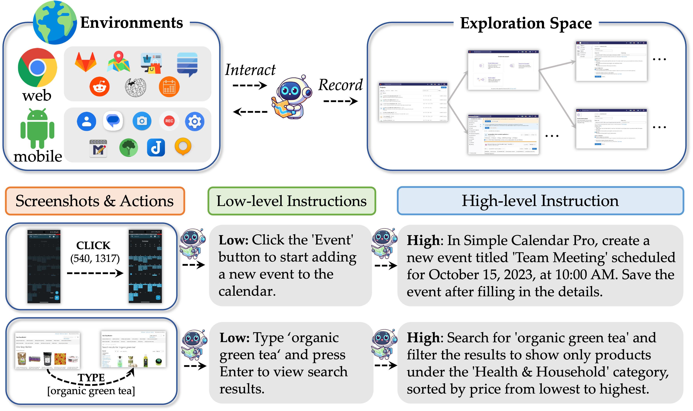

# OS-Genesis


[](https://arxiv.org/abs/2412.19723) 

[](https://huggingface.co/papers/2412.19723)
[](https://mp.weixin.qq.com/s/_gu3NSCpAbAE1A8mEhGD7Q)
<a href = "https://zhuanlan.zhihu.com/p/18229337790"></a>
<!-- [](https://twitter.com/qiushi_sun)
[](https://twitter.com/heroding77)
[](https://twitter.com/chuanyang_jin) -->


This repository contains the code and data for the paper [OS-Genesis: Automating GUI Agent Trajectory Construction via Reverse Task Synthesis](https://arxiv.org/abs/2412.19723).
> We are uploading the data and checkpoints. Due to bandwidth limitations, this will take some time. Stay tuned!


## Overview

We introduce OS-Genesis, an interaction-driven pipeline for synthesizing high-quality and diverse GUI agent trajectory data without human supervision or predefined tasks. By leveraging reverse task synthesis and a trajectory reward model, OS-Genesis enables effective end2end training of GUI agents.

<!--  -->


## Training

For details and operations of the training, please refer to the [InternVL2 documentation](https://internvl.readthedocs.io/en/latest/get_started/installation.html) and [Qwen2-VL](https://github.com/QwenLM/Qwen2-VL).

## Evaluation
### AndroidControl
To evaluate the AndroidControl Benchmark, please follow the steps below:

1. **Clone the GitHub Repository:**

   ```
   git clone https://github.com/OS-Copilot/OS-Genesis.git
   ```

2. **Inference:**
   ```
   cd OS-Genesis/evaluation/android_control
   bash run_ac_inference.sh $dataset $checkpoint
   ```

3. **Evaluation:**
   ```
   pyhton ac_eval.py
   ```

## Mobile
### AndroidControl

|   Model Name    |                           Base Model                                            |                           Training Data                                            |                           HF Link                           |
| :-------------: | :-------------------------------------------------------------------------------------: | :----------------------------------------------------------------------------: | :---------------------------------------------------------: |
| OS-Genesis-4B-AC | [InternVL2-4B](https://huggingface.co/OpenGVLab/InternVL2-4B)            | [OS-Genesis-ac-training-data](https://huggingface.co/datasets/OS-Copilot/OS-Genesis-mobile-data/blob/main/os_genesis_ac_training_data.jsonl) | [🤗 link](https://huggingface.co/OS-Copilot/OS-Genesis-4B-AC)  |
| OS-Genesis-7B-AC | [Qwen2-VL-7B-Instruct](https://huggingface.co/Qwen/Qwen2-VL-7B-Instruct) | [OS-Genesis-ac-training-data](https://huggingface.co/datasets/OS-Copilot/OS-Genesis-mobile-data/blob/main/os_genesis_ac_training_data.jsonl) | [🤗 link](https://huggingface.co/OS-Copilot/OS-Genesis-7B-AC)  |
| OS-Genesis-8B-AC | [InternVL2-8B](https://huggingface.co/OpenGVLab/InternVL2-8B)            | [OS-Genesis-ac-training-data](https://huggingface.co/datasets/OS-Copilot/OS-Genesis-mobile-data/blob/main/os_genesis_ac_training_data.jsonl) | [🤗 link](https://huggingface.co/OS-Copilot/OS-Genesis-8B-AC)  |

### AndroidWorld

|   Model Name    |                           Base Model                                            |                           Training Data                                            |                           HF Link                           |
| :-------------: | :-------------------------------------------------------------------------------------: | :----------------------------------------------------------------------------: | :---------------------------------------------------------: |
| OS-Genesis-4B-AW | [InternVL2-4B](https://huggingface.co/OpenGVLab/InternVL2-4B)            | [OS-Genesis-aw-training-data](https://huggingface.co/datasets/OS-Copilot/OS-Genesis-mobile-data/blob/main/os_genesis_aw_training_data.jsonl) | [🤗 link](https://huggingface.co/OS-Copilot/OS-Genesis-4B-AW)  |
| OS-Genesis-7B-AW | [Qwen2-VL-7B-Instruct](https://huggingface.co/Qwen/Qwen2-VL-7B-Instruct) | [OS-Genesis-aw-training-data](https://huggingface.co/datasets/OS-Copilot/OS-Genesis-mobile-data/blob/main/os_genesis_aw_training_data.jsonl) | [🤗 link](https://huggingface.co/OS-Copilot/OS-Genesis-7B-AW)  |
| OS-Genesis-8B-AW | [InternVL2-8B](https://huggingface.co/OpenGVLab/InternVL2-8B)            | [OS-Genesis-aw-training-data](https://huggingface.co/datasets/OS-Copilot/OS-Genesis-mobile-data/blob/main/os_genesis_aw_training_data.jsonl) | [🤗 link](https://huggingface.co/OS-Copilot/OS-Genesis-8B-AW)  |


## Web

|   Model Name    |                           Base Model                                            |                           Training Data                                            |                           HF Link                           |
| :-------------: | :-------------------------------------------------------------------------------------: | :----------------------------------------------------------------------------: | :---------------------------------------------------------: |
| OS-Genesis-4B-WA | [InternVL2-4B](https://huggingface.co/OpenGVLab/InternVL2-4B)            | [OS-Genesis-web-training-data](https://huggingface.co/datasets/OS-Copilot/OS-Genesis-web-data/blob/main/os_genesis_web_training.jsonl) | [🤗 link](https://huggingface.co/OS-Copilot/OS-Genesis-4B-WA)  |
| OS-Genesis-7B-WA | [Qwen2-VL-7B-Instruct](https://huggingface.co/Qwen/Qwen2-VL-7B-Instruct) | [OS-Genesis-web-training-data](https://huggingface.co/datasets/OS-Copilot/OS-Genesis-web-data/blob/main/os_genesis_web_training.jsonl) | [🤗 link](https://huggingface.co/OS-Copilot/OS-Genesis-7B-WA)  |
| OS-Genesis-8B-WA | [InternVL2-8B](https://huggingface.co/OpenGVLab/InternVL2-8B)            | [OS-Genesis-web-training-data](https://huggingface.co/datasets/OS-Copilot/OS-Genesis-web-data/blob/main/os_genesis_web_training.jsonl) | [🤗 link](https://huggingface.co/OS-Copilot/OS-Genesis-8B-WA)  |


## More Resources

### Raw collected triples

In addition to our complete trajectory data on HuggingFace, we also provide collected raw $<s_{\text{pre}}, a, s_{\text{post}}>$ triples. You can use them to reproduce the process of reverse task synthesis directly, without re-collecting them from emulators yourself 😄. The screenshots and corresponding texts (with SoM info contained) are provided below:

|   Data Type    |                           Screenshots                                            |                           Data JSON                                            |
| :-------------: | :-------------------------------------------------------------------------------------: | :----------------------------------------------------------------------------: |
| Mobile | [Screenshots](https://drive.google.com/file/d/1ILyz_-DDOdAk32kue1lEPaV50YzQ5c4v/view?usp=sharing) | [Data JSON](https://drive.google.com/file/d/1dSxNf-co4LGh93NoiUgWKdbcf8Mo_VWG/view?usp=sharing) |
| Web | [Screenshots](https://drive.google.com/file/d/1X2QktZ51OUofZ43vDGB4RuAPlXbdf5ua/view?usp=sharing) | [Data JSON](https://drive.google.com/file/d/1mDxhonGnd3wZbNQgWMVpYEkPW26_FVg8/view?usp=sharing) |

Feel free to email me if you require additional data of this kind.

## FAQ ❓

We have collected some questions from emails, Hugging Face, and WeChat communications. Please check the [FAQ](https://github.com/OS-Copilot/OS-Genesis/blob/main/faq.md) 🤖

## Citation 📖

🫶 If you are interested in our work or find this repository / our data helpful, please consider using the following citation format when referencing our paper:

```bibtex
@article{sun2024genesis,
  title={OS-Genesis: Automating GUI Agent Trajectory Construction via Reverse Task Synthesis},
  author={Sun, Qiushi and Cheng, Kanzhi and Ding, Zichen and Jin, Chuanyang and Wang, Yian and Xu, Fangzhi and Wu, Zhenyu and Jia, Chengyou and Chen, Liheng and Liu, Zhoumianze and others},
  journal={arXiv preprint arXiv:2412.19723},
  year={2024}
}
```
